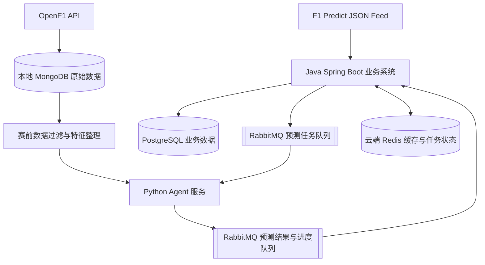
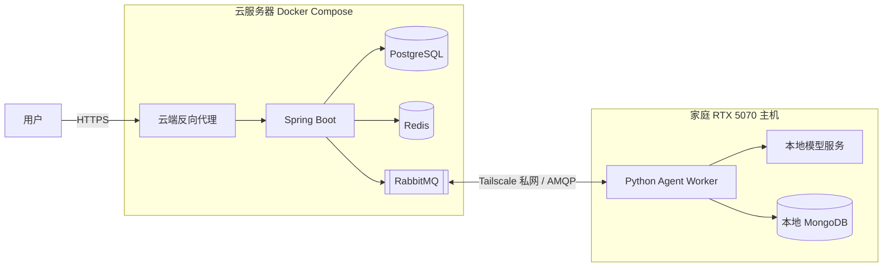

# F1 AI Predict 项目可行性分析

本文档是独立的决策文档，基于项目计划书（`f1-ai-predict-project-plan.md`，2026-08-26，规划状态）整理而成。读者不需要先读计划书即可理解本文：所有关键技术选型、数据边界、模型方案和风险评估都在本节及以下各节独立说明。文中所有标注为"估计"的数字都是经验参考值，不是承诺或保证；未标注保证性的描述一律按"需要实测确认"理解。

## 1. 执行结论

项目整体可行，建议按本文档方案继续推进。

- **结论一**：F1 Predict 前端使用结构化 JSON Feed 提供赛程、当前轮次、预测问题和官方答案，第一版不需要 Playwright、Selenium、Scrapy 或 HTML 页面解析。
- **结论二**：OpenF1 是独立的社区数据项目，提供遥测、圈速、位置、天气等比赛数据，**不提供 F1 Predict 题目答案，也不提供模型预测接口**（即 OpenF1 没有预测端点）。题目仍由 F1 Predict Feed 获取，预测由本项目 Agent 生成。
- **结论三**：OpenF1 数据已按要求保存到本地 MongoDB 并完成时间边界隔离设计，可作为赛前特征的可重放数据来源。
- **结论四**：主推模型为 Qwen3-8B 指令模型 + 4-bit QLoRA，先用 Qwen3-4B 同级模型跑通链路再升级。模型的具体仓库名称、许可证和训练模板必须在下载时以官方模型卡及当时 LLaMA-Factory 版本为准，本文不做承诺。
- **结论五**：Java 与 Python 的预测任务采用 RabbitMQ 异步消息通信；Redis 保存带 TTL 的热点缓存、任务进度、幂等键和短期锁。RabbitMQ 与 Redis 均不替代 PostgreSQL 的最终业务数据职责。
- **结论六**：部署采用云端 Docker 与家庭 GPU 主机分离的混合架构。云端运行 Java、RabbitMQ、Redis 和 PostgreSQL；家庭 RTX 5070 主机运行 Python Worker、模型和本地 MongoDB。家庭主机通过 Tailscale 私网主动连接云端 RabbitMQ，不暴露模型 HTTP 端口。
- **结论七**：主要技术难点不在数据采集，而在 Agent 数据质量、赛前时间边界、多题型计分、消息幂等、跨网络故障恢复和预测结果可追溯性。这些难点都有明确应对方案，不构成项目阻断项。

## 2. 项目范围

### 2.1 做什么

构建一个 F1 赛前预测系统，自动获取 [F1 Predict](https://f1predict.formula1.com/en/) 每轮比赛的预测问题，由 Python Agent 收集赛前资料并生成结构化预测，再由 Java Spring Boot 系统完成展示、锁定、结算和准确率统计。

完整业务闭环：

```text
获取赛程和问题 → Agent 生成预测 → 锁定赛前预测
       → 获取官方答案 → 自动评分 → 统计预测效果
```

### 2.2 不做什么（首版明确不做）

- F1 账号注册与登录。
- 自动向 F1 Predict 提交答案。
- 模拟或复制 F1 Predict 官方页面。
- F1 官方用户联赛、奖品和领奖系统。
- 实时比赛下注。
- 多 Agent 辩论。
- Kafka 等流处理平台或复杂消息集群；首版仅部署单套 RabbitMQ，满足 Java 与 Python 的异步任务解耦。
- Kubernetes 和复杂微服务拆分。
- 完整管理后台页面（首版用 Swagger/OpenAPI 管理即可）。

> [!important] 已确认的边界
> 系统只获取公开问题、生成预测并在自己的系统中展示和评分；不登录 F1 官网，也不向 F1 Predict 自动提交答案。

### 2.3 数据源可行性评估

| 能力 | 可行性 | 说明 |
| --- | --- | --- |
| 获取 F1 赛程 | 高 | 存在结构化赛程 Feed |
| 获取每轮预测问题 | 高 | 问题、选项、积分和题型均为 JSON |
| 获取官方答案 | 高 | 已结束轮次的 `Answer` 包含官方结果 |
| Java 数据采集 | 高 | Spring `WebClient` 即可完成 |
| Python Agent 预测 | 高 | 输入问题及候选项结构明确 |
| 自动评分 | 中高 | 需要适配单选、排序和数值等题型 |
| 长期稳定运行 | 中 | Feed 是网站内部接口，不是承诺稳定的公共 API |

## 3. OpenF1 数据与本地 MongoDB

### 3.1 数据概况

OpenF1 是独立的社区项目，提供 F1 的遥测、圈速、位置、进站、天气、赛道控制和积分榜等数据，通过 `https://api.openf1.org/v1` 按 Session、车手、时间范围等条件查询，默认返回 JSON，也支持 CSV。

- 官方页面说明免费历史数据覆盖 2023 赛季以来的 Session，免费层有访问频率限制；具体以官方文档当前限制为准。
- OpenF1 当前定位主要面向个人、教育和研究用途，页面标注 CC BY-NC-SA 4.0；商业化前必须单独核对许可、数据来源和相关网站条款。
- **本项目已经将从 OpenF1 获取的数据保存到本地 MongoDB**。

### 3.2 MongoDB 的职责

- 保存 OpenF1 原始响应和采集元数据，作为可重放的数据落地区。
- 按 `session_key`、`meeting_key`、`driver_number`、`date` 等条件建立查询索引。
- 记录 `sourceUrl`、`fetchedAt`、`sessionKey`、`contentHash` 和数据版本，支持去重、补采和审计。
- 在预测截止时间之后禁止将新采集数据混入该次预测上下文；每次预测必须保存实际使用的数据截止时间。
- Python Agent 读取经过时间边界过滤和特征整理后的 MongoDB 数据，不直接依赖外部接口的实时可用性。

### 3.3 数据与预测问题的对应关系

| 预测内容 | 主要数据 | 特征示例 |
| --- | --- | --- |
| 排位或正赛名次 | `session_result`、`position`、`laps` | 近期排名、圈速、位置变化、完赛率 |
| 车手/车队表现 | `drivers`、`championship_drivers`、`championship_teams`、历史 Session | 赛季积分、近几站积分、队友差值 |
| 轮胎与进站相关问题 | `stints`、`pit`、`laps` | 胎种、胎龄、进站次数、长距离圈速 |
| 天气和赛道条件 | `weather`、`race_control` | 温度、降雨、风速、红旗和安全车信息 |
| 事故、旗帜和比赛事件 | `race_control`、`intervals`、`position` | 事件时间、受影响车手、间隔变化 |

不同题型只允许使用题目截止时间之前已经写入 MongoDB 的数据。若某类特征缺失，应在上下文中标记缺失，不用赛后数据补齐。

> [!warning] OpenF1 合规要点
> OpenF1 不是 F1、FIA 或 FOM 的官方接口。采集程序需要遵守当前请求频率限制，使用缓存和有限重试，并保存原始响应。商业部署前必须完成许可和网站条款评估。

## 4. F1 Predict 问题 Feed

### 4.1 已发现的数据源

```text
# 当前比赛及系统状态
https://f1predict.formula1.com/feeds/limits/constraints.json

# F1 赛程和比赛 Session
https://f1predict.formula1.com/feeds/schedule/raceday_en.json

# 指定轮次预测问题
https://f1predict.formula1.com/feeds/questions/questions_{gamedayId}_en.json

# 当前活动和版本配置
https://f1predict.formula1.com/feeds/live/mixapi.json

# Web 前端配置
https://f1predict.formula1.com/feeds/apps/web_config.json
```

### 4.2 问题 Feed 的重要字段

- `Id`：题目唯一标识。
- `No`：题目序号。
- `Text`：问题正文。
- `SubText`：补充说明。
- `OptionTemplateId`：题型标识。
- `Status`：题目状态。
- `Config.ChoiceLimit`：可选答案数量。
- `Options`：候选答案列表。
- `Options[].Points`：答案对应积分。
- `Options[].Chance`：网站提供的概率指标。
- `Answer`：官方答案，比赛结束前通常为空。
- `FeedTime`：Feed 更新时间。

> [!warning] 数据源风险
> 这些 Feed 可以由网站前端公开读取，但不代表 F1 官方承诺其长期兼容性。系统需要限制访问频率、缓存结果、保存原始响应，并在投入商业使用前核对网站条款。

## 5. 系统边界：MongoDB / PostgreSQL / RabbitMQ / Redis / Python / Java

本项目采用双数据库分工，不以 MongoDB 替换 PostgreSQL。

### 5.1 组件职责划分

| 组件 | 职责 | 不负责 |
| --- | --- | --- |
| Java Spring Boot | 业务系统和核心数据唯一管理方：Feed 接入、赛季/分站/Session 管理、题目快照、任务编排、预测持久化与锁定、官方答案同步、自动评分、查询与管理接口、日志审计 | 不直接执行模型推理 |
| Python Agent | 从 RabbitMQ 消费预测任务；读取截止时间以前的 MongoDB 数据；生成特征并调用模型；将预测结果发布到结果队列 | Feed 同步、核心业务数据写入、赛程和题目生命周期、答案同步与评分、锁定规则 |
| RabbitMQ | 承载 Java 发布的预测任务和 Python 发布的预测结果，提供异步解耦、确认、重试和死信处理 | 不作为最终业务数据库 |
| Redis | 由云端 Java 使用：缓存热点查询和短期聚合结果；保存任务进度、幂等键、限流计数和短期分布式锁 | 不供家庭 Python Worker 直接访问；不保存最终预测、官方答案、评分等唯一业务事实 |
| MongoDB | OpenF1 原始文档、采集元数据、可重放的特征来源 | 强一致业务数据 |
| PostgreSQL | 赛程、题目快照、预测批次、Agent 输出、官方答案、评分等强一致业务数据 | OpenF1 原始响应存放（原始响应存 MongoDB，业务侧保存引用、哈希、特征版本和数据截止时间） |

### 5.2 RabbitMQ 异步消息流

预测任务不再采用 Java 直接调用 Python 的异步 HTTP 作为主链路，改为 RabbitMQ 消息通信：

1. Java 创建 `predictionJob`，先在 PostgreSQL 写入 `PENDING` 状态。
2. Java 将包含 `predictionJobId`、题目快照、`dataCutoff`、特征版本和模型版本的消息发布到任务交换机。
3. RabbitMQ 将消息路由到预测任务队列，Python Agent 消费并处理。
4. Python 从家庭主机 MongoDB 读取截止时间以前的数据，复用本地预计算特征集合或生成新特征。
5. Python 将结构化预测结果和进度事件发布到 RabbitMQ；Java 消费后更新云端 Redis 短期状态，并将最终结果写入 PostgreSQL。
6. 临时错误进入延迟重试流程；超过重试次数或消息格式错误的消息进入死信队列，等待人工排查。

建议的逻辑组件：

```text
f1.prediction.exchange
├── f1.prediction.request.queue       # Java → Python 预测任务
├── f1.prediction.result.queue        # Python → Java 预测结果
├── f1.prediction.retry.queue         # 临时失败的延迟重试
└── f1.prediction.dead-letter.queue   # 超过重试次数或不可处理消息
```

可靠性约束：使用持久化队列、持久化消息、发布者确认和消费者手动确认；以至少一次投递为目标。网络故障后可能出现重复消息，因此 `predictionJobId` 必须作为幂等键，Python 和 Java 消费者都不能把重复消息处理成重复业务结果。RabbitMQ 的确认机制不等于业务事务，最终状态仍以 PostgreSQL 为准。

### 5.3 Redis 使用边界

Redis 采用缓存和任务状态用途，不替换 MongoDB 或 PostgreSQL：

- **查询缓存**：缓存云端热点赛程、题目、统计和已整理的短期聚合结果；缓存失效后由 Java 回源 PostgreSQL。
- **任务状态**：Java 根据 RabbitMQ 进度事件保存短期进度、最近心跳和消费重试次数，便于查询任务运行状态；最终状态必须同步写 PostgreSQL。
- **特征缓存边界**：家庭 Worker 不跨网络访问 Redis；OpenF1 特征在本地 MongoDB 的预计算集合或 Worker 本地缓存中复用，键包含 `meetingKey`、`sessionKey`、`dataCutoff` 和 `featureVersion`。
- **幂等键**：记录已处理的 `predictionJobId`、消息 ID 或结果版本，并设置合理过期时间。
- **分布式锁**：仅用于防止同一任务被并发执行；锁必须设置 TTL、校验持有者，不能作为最终一致性依据。

Redis 键必须设置 TTL 和命名空间，避免短期数据无限增长。Redis 故障时，核心结果不能丢失：缓存可以回源，任务状态可以从 PostgreSQL 重建；不把 Redis 作为唯一业务数据源。

### 5.4 关键约束

- Python Agent 只读取家庭主机 MongoDB，不直接访问云端 Redis 或 PostgreSQL；预测结果和进度通过 RabbitMQ 交给 Java 处理。
- Java 发送任务时携带预测上下文版本或数据截止时间，保证预测结果可追溯。
- 一个 Grand Prix 可能包含多个 Session，不能直接将每个 `RaceId` 当作独立分站。
- 数据库时间统一使用 UTC，接口层再按客户端时区展示。
- RabbitMQ 消费者必须手动确认；只有完成业务校验并成功写入对应状态后才 ACK。



## 6. 云端 Docker + 家庭 GPU 混合部署

### 6.1 推荐部署拓扑

云服务器使用 Docker Compose 部署业务和基础设施，家庭 RTX 5070 主机部署模型 Worker：

| 位置 | 部署组件 | 说明 |
| --- | --- | --- |
| 云服务器 | 反向代理、Java Spring Boot、PostgreSQL、Redis、RabbitMQ | 负责公网 API、业务数据、消息编排、缓存和任务状态 |
| 家庭 RTX 5070 主机 | Python Agent Worker、模型推理服务、MongoDB | 负责 OpenF1 特征读取和 GPU 推理；模型服务只监听本机或 Docker 内网 |
| 两端之间 | Tailscale 私有网络 | 家庭 Worker 主动连接云端 RabbitMQ，不需要家庭公网 IP、端口映射或 DDNS |



这套架构不要求云端主动访问家庭主机。Python Worker 作为 RabbitMQ 客户端，从家庭网络发起出站连接，因此可以穿过常见家庭 NAT；模型 HTTP 端口不暴露到公网，也不需要通过反向代理发布。

### 6.2 云端 Docker Compose 边界

建议一个云端 Compose 项目包含：

```text
reverse-proxy
spring-boot-api
postgresql
redis
rabbitmq
```

部署约束：

- 只有反向代理的 `80/443` 对公网开放；生产环境将 HTTP 重定向到 HTTPS。
- PostgreSQL、Redis、RabbitMQ 管理界面不对公网开放，只在 Docker 网络或 Tailscale 私网访问。
- RabbitMQ AMQP 监听地址只允许家庭 Worker 通过私网访问；若因环境限制必须开放公网端口，则使用 AMQPS、mTLS、防火墙白名单和专用 vhost，但这只是备选方案。
- Java、PostgreSQL、Redis 和 RabbitMQ 使用 Docker 命名卷持久化必要数据，并设置健康检查和重启策略。
- 密码、证书和连接串通过环境文件、Docker secrets 或云厂商密钥服务注入，不写入镜像和代码仓库。
- 定期备份 PostgreSQL；RabbitMQ 队列不能替代业务数据库备份。

### 6.3 家庭 GPU 主机边界

家庭主机建议使用 Docker Compose 或系统服务运行：

```text
python-agent-worker
model-runtime
mongodb
 tailscale-client（可运行在宿主机）
```

部署约束：

- Python Worker 是唯一需要访问模型服务的组件，模型端口只绑定 `127.0.0.1` 或家庭主机 Docker 内网。
- Python Worker 只需连接云端 RabbitMQ；不直接访问云端 PostgreSQL 和 Redis，减少数据库暴露面和跨网络耦合。
- 预测任务消息携带题目、选项、`dataCutoff`、上下文版本和必要特征标识；Python 在本地主机读取 MongoDB 并生成特征。
- OpenF1 原始 MongoDB 保留在家庭主机，可避免大体量遥测文档跨公网反复传输。必须定期备份；若家庭磁盘损坏，应能从 OpenF1 或离线备份恢复。
- Worker 设置 RabbitMQ 心跳、自动重连和指数退避；GPU OOM 或进程崩溃后由 Docker/系统服务自动重启。
- 家庭主机关机或断网期间不 ACK 消息，任务保留在云端 RabbitMQ；恢复后继续消费。系统页面显示 `PENDING`、`RUNNING`、`RETRYING` 或 `WORKER_OFFLINE`，不得伪报成功。

### 6.4 网络与安全方案

首选 **Tailscale 私网**，备选为自建 WireGuard：

1. 云服务器和家庭主机加入同一个 Tailscale 网络。
2. 使用访问控制规则，只允许家庭 Worker 访问云服务器的 RabbitMQ AMQP 端口；禁止访问 PostgreSQL、Redis 和云端管理端口。
3. RabbitMQ 为 Worker 创建专用用户和专用 vhost，只授权预测任务队列的消费权限和结果交换机的发布权限。
4. RabbitMQ 管理界面仅允许管理员通过 Tailscale 访问。
5. 即使使用 Tailscale，也建议保留 RabbitMQ 用户认证；有更高安全要求时叠加 TLS/mTLS。
6. 不使用 Tailscale Funnel 或其他公网隧道暴露模型服务。

Tailscale 不可用或不希望依赖第三方协调服务时，可以使用 WireGuard。家庭主机位于 NAT 后时，需要配置 `PersistentKeepalive`；密钥轮换、对端配置和故障排查由项目自行维护。

### 6.5 消息体与数据传输

RabbitMQ 消息应保持小而稳定，避免把完整遥测数据或大段模型上下文塞入队列：

- 请求消息主要包含 `messageId`、`predictionJobId`、题目快照、候选项、`dataCutoff`、模型版本和特征版本。
- 原始 OpenF1 数据保留在家庭 MongoDB，由 Worker 本地读取。
- 结果消息只包含结构化预测、置信度、摘要、证据引用和运行元数据。
- 模型权重、训练数据集、日志文件和大型附件不通过 RabbitMQ 传输。
- 每条消息配置合理的最大长度和过期时间；过期任务进入死信队列或由 Java 标记为超时。

### 6.6 故障与降级行为

| 故障 | 系统行为 |
| --- | --- |
| 家庭主机关机或断网 | 云端继续接收业务请求；预测任务留在 RabbitMQ，恢复后继续处理 |
| Python Worker 崩溃 | 未 ACK 消息重新入队；Worker 自动重启后幂等重试 |
| GPU OOM | 记录失败原因，降低批大小/上下文或进入有限重试；超过次数进入死信队列 |
| Tailscale 暂时中断 | RabbitMQ 客户端指数退避重连；不删除未完成任务 |
| RabbitMQ 不可用 | Java 保留 PostgreSQL 中的待发布状态，恢复后重新发布；不能只依赖内存重试 |
| Redis 不可用 | 缓存回源，任务最终状态从 PostgreSQL 查询；不影响已经落库的预测结果 |
| 家庭 MongoDB 不可用 | Worker 停止对应预测并上报可重试错误，不使用缺失或赛后数据替代 |

如果预测有严格截止时间，家庭 Worker 长期离线会导致任务无法完成。MVP 可采用告警和人工处理；后续可增加小型云端备用模型，但备用模型必须独立记录 `model` 和 `deploymentTarget`，不能与家庭微调模型的结果混淆。

### 6.7 监控和运维

- 云端监控 RabbitMQ 队列深度、最老消息年龄、消费者数量、未确认消息、重试和死信数量。
- 家庭 Worker 定期发布心跳事件，云端记录最后在线时间、GPU 显存、模型加载状态和当前任务。
- Java 以 PostgreSQL 状态机判断任务是否完成，不以 Redis 心跳或 RabbitMQ ACK 代替业务结果。
- 为队列堆积、Worker 离线、死信出现、GPU OOM 和预测接近截止时间设置告警。
- 日志使用统一的 `traceId`、`messageId` 和 `predictionJobId`，支持跨云端与家庭主机排查。

## 7. Predict 内容定义与示例结构

这里的"predict 内容"分为三层，避免把题目、输入资料和模型答案混为一体：

1. **题目内容**：从 F1 Predict question Feed 获取，包括题目文本、题型、选项、积分和题目快照。
2. **预测上下文**：由 Java 传入题目快照和截止时间，Python Agent 从本地 MongoDB 读取截止时间以前的 OpenF1 数据，整理为可解释的统计特征。
3. **预测输出**：模型只返回候选 `optionId`、排序位置、置信度、摘要和证据，Java 再按既有接口校验、保存、锁定和评分。

### 7.1 单条预测输出的结构（字段级定义）

预测必须绑定 `optionId`，不能只保存车手或车队名称。每条预测至少保存：

- 预测任务 ID。
- 题目 ID 和题目快照 ID。
- 选择的选项 ID 及排序位置。
- Agent 置信度。
- 简短分析摘要。
- 证据来源和发布时间。
- 数据截止时间（`dataCutoff`）。
- 模型名称、Agent 版本、Prompt 版本。
- 生成时间和锁定时间。
- 原始 Agent 响应（留档）。

```json
{
  "questionId": 476,
  "selectedOptions": [{"optionId": 117, "position": 1}],
  "confidence": 0.73,
  "reasoningSummary": "基于近期排位速度和赛道适配性。",
  "evidence": [{"source": "数据来源名称", "url": "https://example.com/source", "publishedAt": "2026-08-20T10:00:00Z"}],
  "sourceDataCutoff": "2026-08-20T12:00:00Z",
  "model": "模型名称",
  "agentVersion": "1.0.0",
  "promptVersion": "f1-race-v1"
}
```

### 7.2 特征输入上下文

Java 发布到 RabbitMQ 的预测任务消息需要携带 `dataCutoff`、`raceContext`（赛季、meetingKey、sessionKey、赛道、Session 列表）和特征版本。Python 消费任务后从家庭主机 MongoDB 的原始集合、预计算集合或 Worker 本地缓存获得 `features`（车手状态、圈速、进站、天气等）。特征生成必须保留原始文档引用和计算窗口，例如 `sessionKey`、数据集合、查询时间范围和特征版本。

数值特征用于排序和校验，模型主要负责将结构化证据映射到题目选项；**不能把大模型当作精确数值计算器**。首版输出强制为 JSON，并在服务端校验 `optionId`、排序数量、置信度范围和 `dataCutoff`。

## 8. 微调方案：LLaMA-Factory + QLoRA

### 8.1 工作流

RTX 5070 采用 4-bit QLoRA 作为首选路线，**不建议在单卡上做全参数训练**。初始实验顺序：

1. 安装 LLaMA-Factory，准备经脱敏和时间切分的数据集。
2. 用 Qwen3-4B 同级指令模型跑通流程和显存基线。
3. 复制官方 QLoRA/SFT 示例，设置 `stage: sft`、`finetuning_type: lora`、4-bit 量化、`per_device_train_batch_size: 1`、梯度累积和梯度检查点；序列长度从 2048 开始实测。
4. 用验证集观察损失和结构化输出准确率，不以训练损失单独判断效果。
5. 导出 LoRA 适配器；需要独立部署时再合并权重，并用固定测试集验证合并前后输出一致。
6. Python Agent 通过本地推理服务调用模型，保留模型版本、适配器版本、Prompt 版本和数据版本。

命令形态参考（具体 YAML 文件以当前仓库为准）：

```bash
llamafactory-cli train examples/train_lora/qwen3_lora_sft.yaml
llamafactory-cli chat examples/inference/qwen3_lora_sft.yaml
llamafactory-cli export examples/merge_lora/qwen3_lora_sft.yaml
```

> [!warning] 下载时需核实
> 模型的具体仓库名称、许可证和训练模板必须以官方模型卡及当前 LLaMA-Factory 版本为准，本文档不做承诺。下载和复现前必须核对 Hugging Face 模型卡、许可协议和对应训练模板文件。

### 8.2 RTX 5070 约束

- 显存不是只由参数量决定，还受序列长度、批大小、LoRA 配置、优化器和 KV Cache 影响。
- 以官方 LLaMA-Factory 硬件表为参考，7B 级 4-bit QLoRA 约为 6 GB 量级的**估算值**，实际运行应预留系统、框架和上下文开销。**该数值是经验参考，不是 RTX 5070 的保证值，也不代表 RTX 5070 的实际显存容量**。RTX 5070 的具体显存容量需以显卡规格为准，本机峰值显存和训练稳定性以实测为准。
- 若显存不足：4-bit 量化、批大小 1、梯度累积、梯度检查点；从 4B 冒烟再升到 8B。

### 8.3 模型推荐结论

- **主推**：Qwen3-8B 指令模型 + 4-bit QLoRA。理由是中文和英文支持较好、适合结构化指令任务、LLaMA-Factory 有对应 Qwen3 训练模板，且 8B 规模比更大模型更适合单卡反复实验。
- **基线**：先用 Qwen/Qwen3-4B-Instruct-2507 或当前同级 4B 指令模型完成数据格式、训练参数和 JSON 输出链路验证，再切换到 8B 主模型。4B 不是最终效果上限，而是降低首轮实验成本的基线。
- **更大模型（14B 及以上）**：不建议作为首轮本地方案，仅在 8B 有明确收益后再做云端实验。
- **评估纪律**：只有在未参与训练的比赛轮次上稳定超过基线，才保留微调模型；否则使用结构化特征加基座模型的方案。

| 方案 | 训练方式 | RTX 5070 适配性 | 用途 |
| --- | --- | --- | --- |
| Qwen3-4B | 4-bit QLoRA，序列长度 2048 起步 | 高 | 冒烟测试、数据和 Prompt 验证 |
| Qwen3-8B | 4-bit QLoRA，批大小 1，梯度累积 | 推荐先实测 | 正式本地微调主方案 |
| Qwen3-14B 及以上 | 4-bit QLoRA 或卸载 | 不建议首轮本地 | 8B 有明显收益后再云端实验 |
| 全参数微调 | FP16/BF16 | 不适合单张 RTX 5070 | 不纳入 MVP |

## 9. 数据集构建

### 9.1 数据来源

从 MongoDB 导出 OpenF1 数据，并基于已结算的 F1 Predict 历史题目生成微调样本。

### 9.2 格式

采用 LLaMA-Factory 的 Alpaca JSON/JSONL 格式，并在 `dataset_info.json` 中登记数据集：

```json
{
  "f1_predict_sft": {
    "file_name": "f1_predict_sft.jsonl",
    "columns": {
      "prompt": "instruction",
      "query": "input",
      "response": "output",
      "system": "system"
    }
  }
}
```

单条样本的字段构成：

- `system`：角色与约束提示，例如"你是 F1 赛前预测助手。只使用 dataCutoff 之前的数据，必须返回合法 JSON。"
- `instruction`：任务指令，例如"根据赛前数据回答题目，并从给定选项中选择。"
- `input`：题目、截止时间和特征上下文（如 `dataCutoff`、`questionId`、`options`、`features`）。
- `output`：结构化预测标签，即第 7 节的预测输出结构。

训练标签应来自已结算的历史题目，并保留 `questionType`、评分结果和数据版本，便于按题型评估。

## 10. 防泄漏（Anti-leakage）

这是本项目离线评估有效性的前提，措施如下：

- **按比赛轮次切分数据集**：按赛季或比赛轮次划分训练集、验证集和测试集，禁止随机打散，避免同一场比赛的相邻记录同时出现在训练和测试中。
- **赛前输入、赛后标签**：只使用赛前可见数据生成输入，使用比赛结束后的官方答案生成标签；官方答案不得泄露到输入字段。
- **训练前检查**：训练前执行字段和截止时间检查，自动确认输入中不存在官方答案或赛后字段。
- **推理期强制**：预测上下文以 `dataCutoff` 为硬边界，只允许使用截止时间之前的 MongoDB 数据和来源；每条预测保存实际数据截止时间。
- **思考模式一致性**：若使用 Qwen3 的思考模式，训练和推理必须保持 `enable_thinking` 设置一致；首版建议关闭思考输出或仅训练简短可审计摘要，避免将不可验证的长篇思维链作为标签。

## 11. 评估指标

- 按赛季或比赛轮次切分数据评估，禁止随机打散。
- 按单选、多选、排序和数值题分别统计：准确率、得分、精确位置率、部分位置得分。
- 单独统计：合法 JSON 率、有效选项率、置信度校准误差、证据截止时间合规率。
- 对比：固定 Prompt 基线、Qwen3-4B 微调模型、Qwen3-8B 微调模型。
- 评分因子：排序题需区分选项错误、选中但位置错误、选中且位置正确。
- 网关阈值：模型输出 JSON 的格式有效率不低于 99%，无效 `questionId` 或 `optionId` 必须被拒绝。

## 12. 主要风险及应对

| 风险 | 影响 | 初步应对措施 |
| --- | --- | --- |
| Feed 路径或字段变化 | 数据同步失败 | 原始响应留档、格式校验、同步告警 |
| 来源站点限制访问 | 无法获取新题目 | 低频访问、缓存、指数退避、人工同步入口 |
| Agent 引用赛后信息 | 预测失去可信度 | 保存数据截止时间，只允许截止前来源 |
| Agent 返回无效选项 | 无法评分 | 严格校验 `questionId` 和 `optionId` |
| 时区处理错误 | 错过锁定时间 | 数据库存储 UTC，提前安全窗口锁定 |
| 题型计分规则理解错误 | 分数不准确 | 按题型策略实现，使用历史轮次回归验证 |
| Agent 或模型波动 | 结果不稳定 | 保存模型、Agent 和 Prompt 版本 |
| OpenF1 数据覆盖或字段不足 | 某些题型无法构造特征 | 记录缺失率；缺失时降级为已有特征并在结果中标记 |
| 赛后信息泄露到训练集 | 离线准确率虚高 | 按比赛轮次和时间切分；训练前执行字段和截止时间检查 |
| RTX 5070 显存不足 | QLoRA 训练中断或频繁换页 | 4-bit 量化、批大小 1、梯度累积、梯度检查点；从 4B 冒烟再升到 8B |
| 模型输出不是合法 JSON | 无法校验和评分 | 使用明确 JSON Schema、解析失败重试一次并记录原始响应 |
| RabbitMQ 消息重复投递 | 重复执行预测或重复写入结果 | 使用手动 ACK、发布者确认、`predictionJobId` 幂等键和 PostgreSQL 状态校验 |
| RabbitMQ 消费失败或消息堆积 | 预测任务延迟或丢失 | 配置持久化队列、有限重试、死信队列、消费延迟和堆积监控 |
| RabbitMQ 与业务事务不一致 | 消息已确认但业务未落库 | 只有业务写入成功后才 ACK；失败时不 ACK 或进入重试，不能以 ACK 代替数据库事务 |
| Redis 缓存过期或实例故障 | 任务查询变慢或短期状态丢失 | 所有缓存设置 TTL；核心任务和结果以 PostgreSQL 为准，Redis 故障时支持回源和状态重建 |
| Redis 锁过期或误释放 | 同一任务并发执行 | 锁设置 TTL、校验持有者；任务处理必须幂等，长任务不把 Redis 锁作为唯一正确性依据 |
| 家庭网络或停电 | GPU Worker 长期离线、预测错过截止时间 | 云端队列保留任务、离线告警、UPS/自动开机；关键截止任务预留人工或云端备用方案 |
| Tailscale/WireGuard 隧道中断 | Worker 无法消费和回传结果 | RabbitMQ 心跳、指数退避重连、未 ACK 消息重新入队、隧道状态监控 |
| 模型端口误暴露 | 未授权推理或主机入侵 | 模型只监听本机/Docker 内网；家庭防火墙拒绝入站；不使用公网 Funnel |
| 家庭 MongoDB 磁盘损坏 | OpenF1 原始数据和特征不可用 | 定期离线备份、磁盘空间告警，并保留从来源重新采集的能力 |
| 商业及合规限制 | 项目无法公开运营 | 上线或商业化前核对网站条款和数据许可 |

## 13. 分阶段执行

### 阶段一：数据采集基础
- 建立 Spring Boot 项目和数据库迁移体系。
- 创建赛季、分站和 Session 数据模型。
- 接入赛程 Feed 和问题 Feed。
- 实现问题与选项的幂等同步，保存原始响应及同步记录。

### 阶段二：题目版本与查询
- 实现题目内容哈希和题目快照。
- 实现分站、题目和选项查询接口。
- 通过历史轮次验证问题与官方答案解析。

### 阶段三：OpenF1 特征与微调基线
- 盘点本地 MongoDB 的 OpenF1 集合、时间覆盖和索引。
- 建立只读取 `dataCutoff` 之前数据的特征生成流程。
- 按比赛轮次生成训练、验证和测试数据，检查答案泄露。
- 使用 Qwen3-4B 同级模型完成 4-bit QLoRA 冒烟实验。
- 在 RTX 5070 上记录峰值显存、训练速度、最大稳定序列长度和推理延迟。
- 使用固定历史轮次比较基座模型、Prompt 基线和微调模型。

### 阶段四：RabbitMQ、Redis 与 Agent 集成
- 定义预测任务和预测结果的消息契约，包含消息版本、`messageId`、`predictionJobId`、`dataCutoff` 和追踪 ID。
- 建立持久化任务队列、结果队列、延迟重试队列和死信队列。
- Java 使用发布者确认发送任务；Python 手动 ACK 消费任务并发布结果；Java 手动 ACK 消费结果。
- 实现预测批次和 PostgreSQL 任务状态机，以 `predictionJobId` 保证双端幂等。
- 云端 Java 使用 Redis 保存带 TTL 的查询缓存、任务进度、幂等键和短期分布式锁；家庭 Worker 的特征复用由本地 MongoDB 预计算集合承担。
- 校验 Agent 返回的题目和选项 ID，保存模型、适配器、Prompt、证据和原始响应。
- 演练 RabbitMQ 连接中断、消费者重启、重复投递、重试耗尽和 Redis 故障回源。
- 切换到 Qwen3-8B 同级模型完成正式 QLoRA 实验。

### 阶段五：混合部署与网络验证
- 使用 Docker Compose 在云服务器部署反向代理、Java、PostgreSQL、Redis 和 RabbitMQ。
- 在家庭 RTX 5070 主机部署 Python Worker、模型服务和 MongoDB，并确保模型端口不对公网开放。
- 建立 Tailscale 私网和最小权限访问规则，仅允许 Worker 访问 RabbitMQ。
- 配置 RabbitMQ 专用用户、vhost、心跳、自动重连、发布者确认、手动 ACK 和死信队列。
- 验证家庭断网、主机重启、GPU OOM、隧道重连、RabbitMQ 重启和消息重复投递。
- 配置 PostgreSQL/MongoDB 备份、队列堆积告警、Worker 离线告警和统一追踪字段。

### 阶段六：锁定与评分
- 实现预测截止时间和自动锁定。
- 实现官方答案同步。
- 实现单选、排序、数值和区间题评分器。
- 保存评分明细和批次总分。

### 阶段七：统计与运维
- 实现单场、赛季和全局准确率统计，模型与 Prompt 版本对比。
- 增加健康检查、日志和指标。
- 增加同步、预测和结算管理接口，使用 Swagger/OpenAPI 完成管理操作。

## 14. 验收标准

第一版完成时，系统应能够：

- 自动识别当前 F1 比赛轮次并自动获取该轮全部预测问题。
- 重复同步不产生重复数据；问题变化时保留历史快照。
- 将整轮问题发送给 Python Agent，保存结构化预测、置信度和依据。
- 在截止时间前锁定预测；比赛结束后获取官方答案。
- 自动计算单题和整轮得分；查询历史比赛预测和准确率。
- 证明每条预测生成于官方答案公布之前。
- 能从本地 MongoDB 重建每条预测使用的 OpenF1 数据范围和特征版本。
- RabbitMQ 任务和结果消息具备发布者确认、消费者手动 ACK、有限重试和死信处理。
- 模拟重复投递时，同一 `predictionJobId` 不会重复生成预测结果或重复结算。
- Redis 缓存和任务状态均有 TTL；Redis 不可用时，核心任务和结果仍可从 PostgreSQL 查询或重建。
- 家庭主机不开放模型公网端口，Python Worker 只通过 Tailscale 私网访问云端 RabbitMQ，不直接访问云端 PostgreSQL 或 Redis。
- 模拟家庭断网和 Worker 重启时，未完成消息保留或重新入队，恢复后可继续幂等处理。
- 云端公网只开放业务 HTTPS 端口；PostgreSQL、Redis、RabbitMQ 管理界面仅允许 Docker 内网或管理私网访问。
- 微调数据按比赛轮次隔离，自动检查输入中不存在官方答案或赛后字段泄露。
- 模型输出 JSON 的格式有效率不低于 99%，无效 `questionId` 或 `optionId` 必须被拒绝。
- 在未参与训练的历史分站上，微调模型至少不低于固定 Prompt 的基座模型；若无提升则保留基座模型方案。

## 15. 官方来源与参考链接

- [F1 Predict 官网](https://f1predict.formula1.com/en/)
- [OpenF1 官网与 API 说明](https://openf1.org/)
- [OpenF1 API 文档](https://openf1.org/docs)
- [OpenF1 GitHub 仓库](https://github.com/br-g/openf1)
- [LLaMA-Factory 官方仓库](https://github.com/hiyouga/LlamaFactory)
- [LLaMA-Factory 数据集格式说明](https://github.com/hiyouga/LlamaFactory/blob/main/data/README.md)
- [LLaMA-Factory 训练示例](https://github.com/hiyouga/LlamaFactory/blob/main/examples/README.md)
- [RabbitMQ 可靠性](https://www.rabbitmq.com/docs/reliability)
- [RabbitMQ 消费者确认与发布者确认](https://www.rabbitmq.com/docs/confirms)
- [RabbitMQ 死信交换机](https://www.rabbitmq.com/docs/dlx)
- [RabbitMQ TLS](https://www.rabbitmq.com/docs/ssl)
- [RabbitMQ 访问控制](https://www.rabbitmq.com/docs/access-control)
- [RabbitMQ 心跳与连接检测](https://www.rabbitmq.com/docs/heartbeats)
- [Docker Compose](https://docs.docker.com/compose/)
- [Docker Secrets](https://docs.docker.com/engine/swarm/secrets/)
- [Tailscale 访问控制](https://tailscale.com/docs/features/access-control/acls)
- [Tailscale Serve 与 Funnel 边界](https://tailscale.com/docs/features/tailscale-serve)
- [WireGuard Quick Start](https://www.wireguard.com/quickstart/)
- [Redis 缓存模式](https://redis.io/docs/latest/develop/use-cases/)
- [Redis 事务与原子操作](https://redis.io/docs/latest/develop/using-commands/transactions/)
- [Redis 分布式锁](https://redis.io/docs/latest/develop/clients/patterns/distributed-locks/)
- [Redis 持久化](https://redis.io/docs/latest/operate/oss_and_stack/management/persistence/)
- [CC BY-NC-SA 4.0](https://creativecommons.org/licenses/by-nc-sa/4.0/)